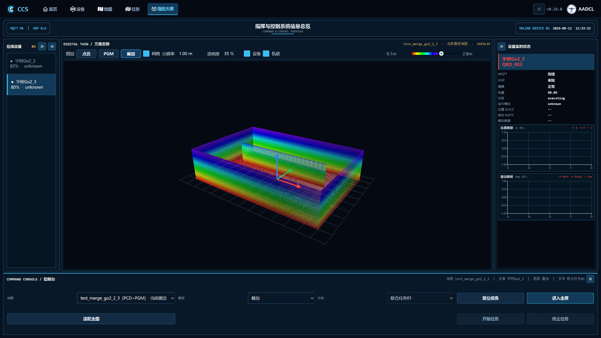
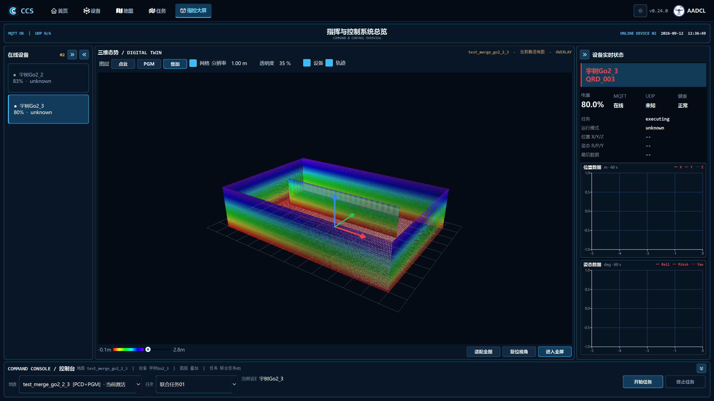
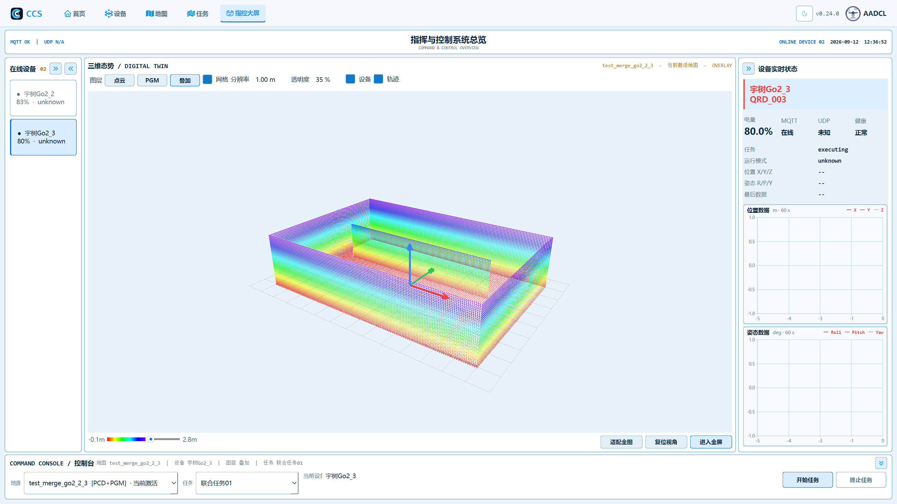
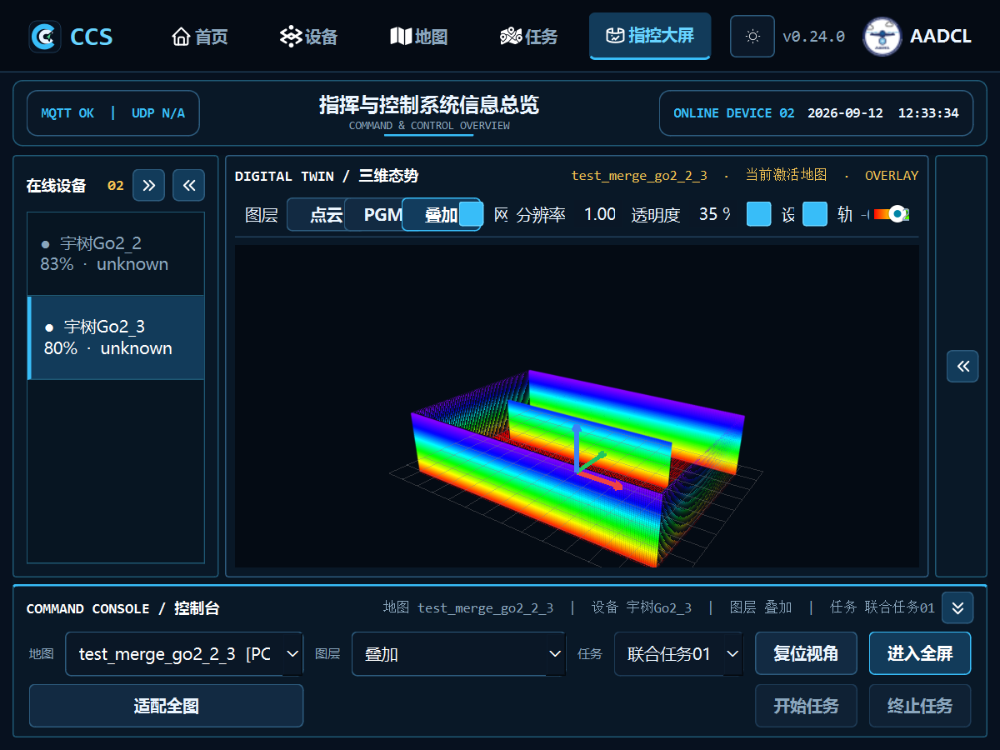
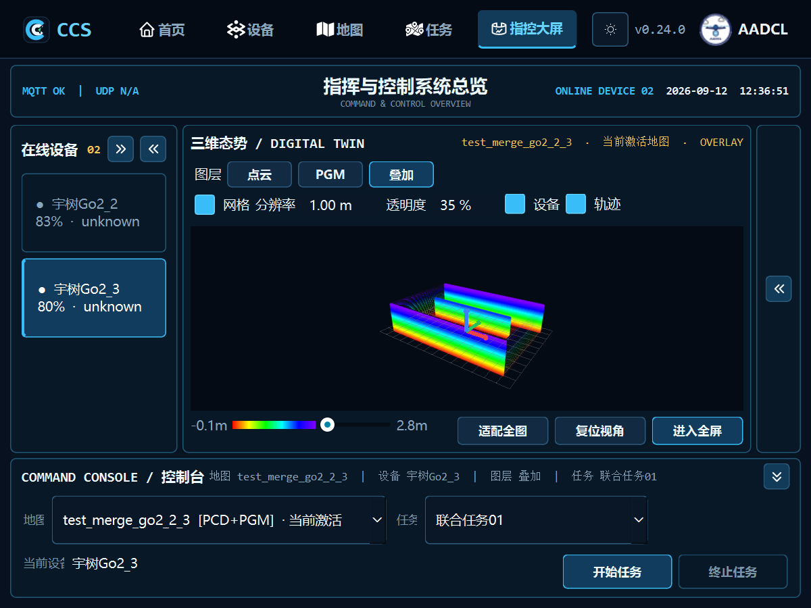
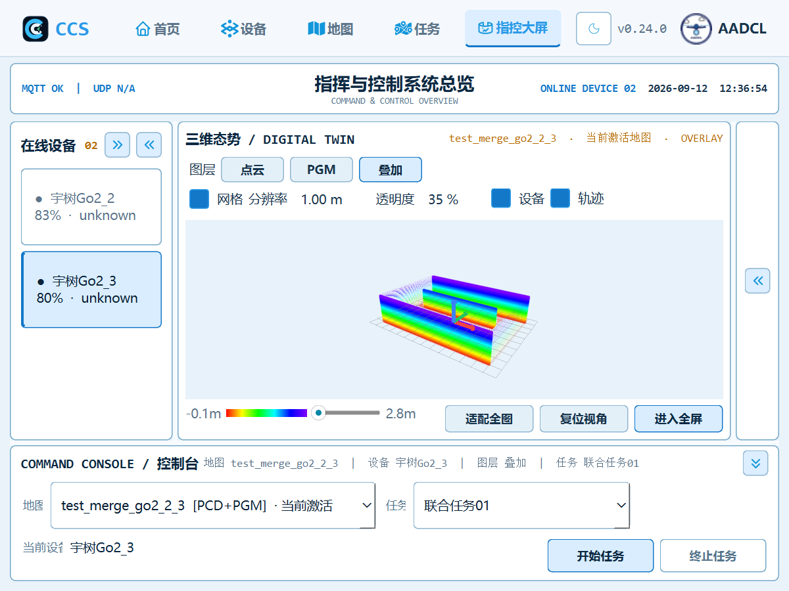
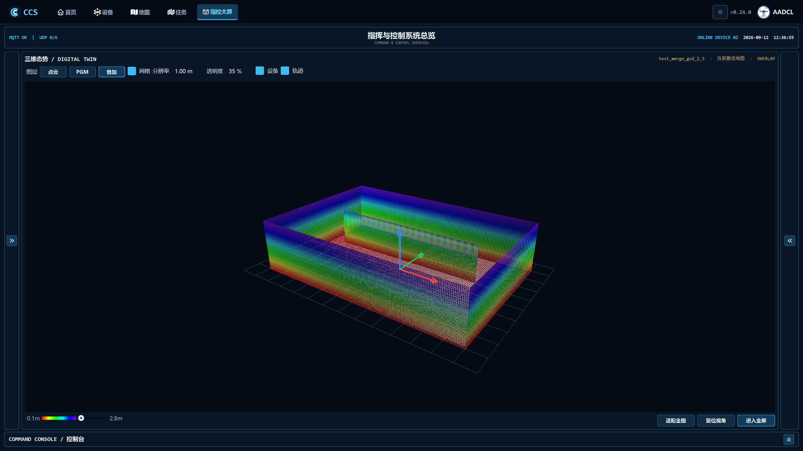

# 指控大屏布局增量验证

验证日期：2026-09-12。基线：`cd9686b9df405f6e67a72ffdf6ff8880d23cca45`。

本次仅调整指控大屏布局、样式及其共享查看器的可选展示方式。顶部五个选项卡及 icon、点云高度过滤、地图操作、遥测图表、设备选择和任务执行逻辑保留。图层入口合并到地图工具栏，内部图层对象保持兼容。

## 验证结果

- 修改前相关测试 **63/63 通过**；修改后 **72/72 通过**，新增 9 项行为回归，无失败、超时或跳过。
- 1920×1080、1440×900、1024×768、800×600 的日夜主题均完成实际 Windows OpenGL 渲染检查；标题中心与横栏中心偏差均为 **0px**，原界面为 56px。
- 1920×1080 的控制台高度从约 **198px 降至 96px**；800×600 时工具栏和控制台换行，右侧收起后仅占 44px，地图获得剩余空间。
- 全屏进入、返回及面板收起恢复后，原 OpenGL 画布保持有效。
- `git diff --check` 通过。服务、协议、地图过滤算法、设备配置和导航图标资源未修改。

## 测试范围与复现

在安装项目运行依赖的 Python 环境中，从仓库根目录运行：

```powershell
python scripts/validate_dashboard_layout.py --output build/dashboard-validation
```

入口按模块启动独立进程，相关 `test_ui` 用例进一步逐用例隔离。每个子进程将默认 Qt 设置重定向到临时 INI，显式临时设置仍由原测试夹具管理。失败、超时、原生崩溃或跳过均导致非零退出。

| 范围 | 用例数 |
| --- | ---: |
| 原大屏、遥测、折叠、全屏与定时器 | 11 |
| 新布局、高度过滤、图层联动与任务操作 | 9 |
| 日夜主题及图标 | 9 |
| 点云和 PGM 读取 | 5 |
| 任务协议及执行服务 | 8 |
| 地图拾取和显示控件 | 15 |
| 地图设备覆盖层 | 10 |
| 轨迹查看器 | 2 |
| 顶部导航、主题切换和窄屏品牌栏 | 3 |
| **合计** | **72** |

新增测试检查高度滑块 0/50/100 对实际点集的过滤结果，保留原“向右隐藏更高点云”的语义；地图按钮、内部图层对象和状态摘要同步；复位/适配各触发原动作一次；临时任务保持原设备集合和启停参数；冲突取消和失败不会启动任务。覆盖折叠期间调整窗口再展开、长状态标题对齐及控件不重叠。

测试明细见 [tests.json](tests.json)，几何测量见 [geometry.json](geometry.json)，基线见 [baseline-tests.json](baseline-tests.json)，源码校验值与环境见 [source-and-environment.json](source-and-environment.json)。

## 实际渲染截图

截图来自真实 Qt/VisPy/OpenGL 的隐藏测试窗口，使用临时地图仓库、合成室内点云及模拟设备。图中状态不是现场遥测，测试没有向真实设备发送动作。

### 修改前 · 夜间 1920×1080



### 修改后 · 夜间 1920×1080



### 修改后 · 日间 1920×1080



### 修改前后 · 800×600







### 面板收起



## 环境与验证边界

实际验证环境为 Windows 11、Python 3.12.14、PySide6 6.11.1、VisPy 0.16.2、NumPy 2.5.1，沿用本机已有验证环境；未修改项目依赖声明。`pyproject.toml` 仍固定 PySide6 6.8.3，本次未在该版本或 Linux 上另行验证。

自动化 UI 测试使用 offscreen 平台，其 OpenGL 平台警告不能作为真实渲染通过的依据；另行运行的 Windows 原生渲染检查已确认画布有效。任务按钮使用模拟执行服务，既有任务协议测试仅使用 localhost；本次结果不等同于真实机器人实机验收，也未声称全量仓库测试通过。
