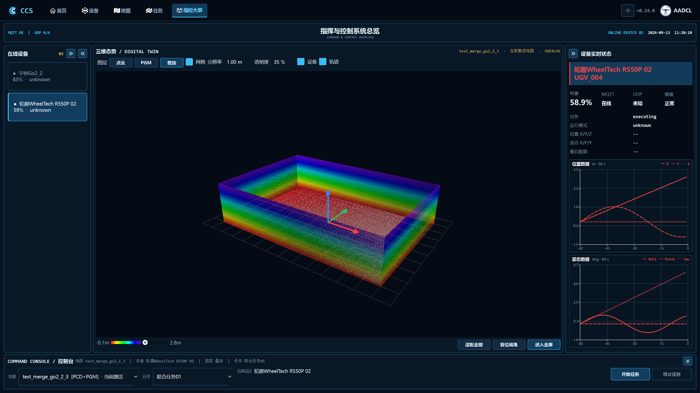
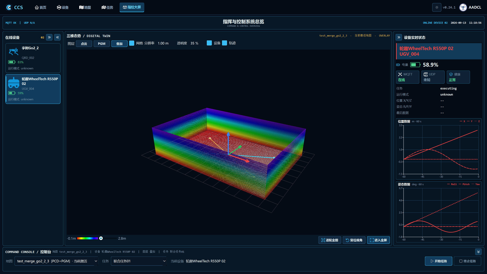
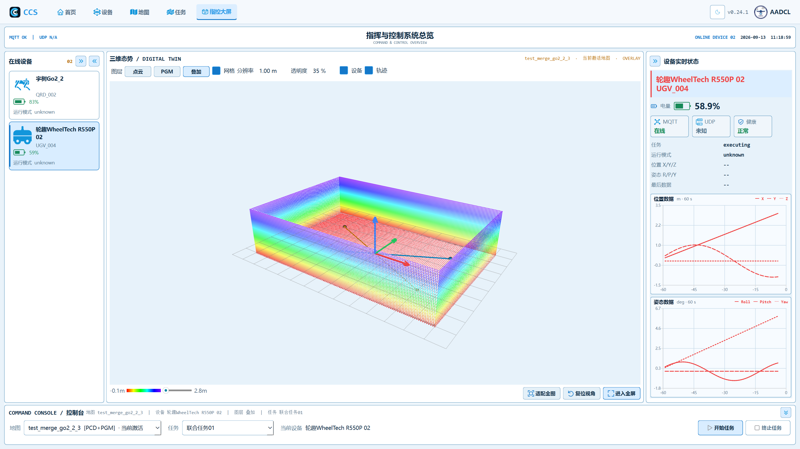
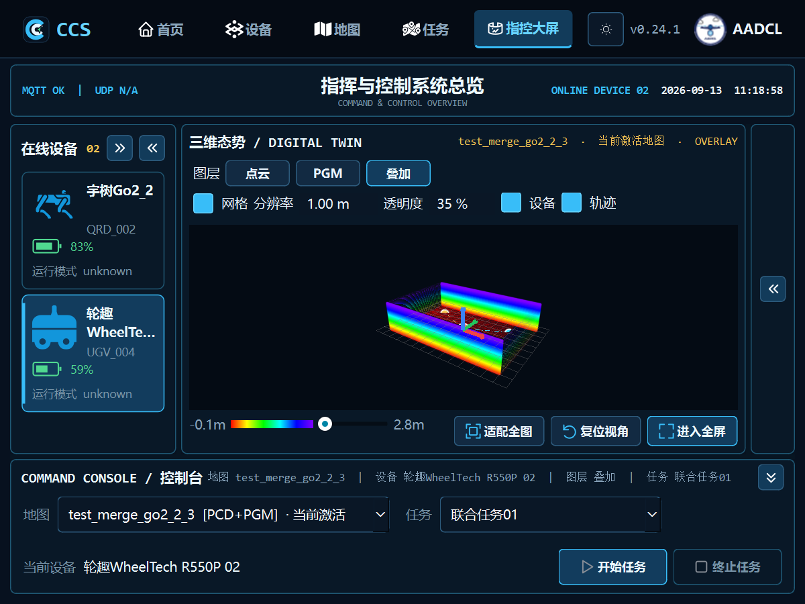

# v0.24.1 指控大屏增量验证

日期：2026-09-13。基线 main `184575bb5ca99a014cf7d6088aa019092fd2a52d`，分支 `codex/dashboard-visual-polish`。
最终提交 SHA 由 PR 指向的提交记录确认；逐项运行结果见 [results.json](results.json)。

## 环境与隔离

本次实际环境：Python 3.12.14、PySide6 6.11.1、VisPy 0.16.2、NumPy 2.5.1，Windows-11-10.0.26200-SP0。
项目声明的 Python / Qt 环境与本机现有环境存在差异；本次没有安装或升级依赖，也未对未运行的环境作兼容性结论。
仅本包版本从 0.24.0 更新至 0.24.1，端侧包与协议版本不变。

新增用例与原生渲染的地图、任务、设备配置和类型仓库均使用临时目录；复用回归沿用各自的临时数据夹具。默认 QSettings 使用临时 INI，执行服务使用模拟对象。
没有向真实设备发送命令，没有运行全量测试，也没有生成发布安装包。

## 结果

| 检查 | 结果 |
| --- | --- |
| main 上相同相关用例基线 | 35 / 35 通过 |
| 修改后相关增量用例 | 44 / 44 通过，其中新增 9 项 |
| 125%、150%、200% DPI 独立进程检查 | 各 1 项通过，均覆盖日夜主题与四种窗口尺寸 |
| 原生 Windows OpenGL | 28,752 点合成 PCD、PGM、双设备任务路线与冲突点正常绘制 |
| 1920×1080、1440×900、1024×768、800×600 | 日夜主题共 8 组检查通过，控件可达、标签无遮挡、标题中心误差 ≤ 2px |
| 面板折叠及全屏 / ESC 返回 | 通过，返回后 OpenGL 上下文仍有效 |

44 项包含原布局、图标、主题、版本和图标分发、任务页及任务冲突的相关回归。新增用例覆盖原始 XYZ、全部任务设备、底图与高度开关、任务更新／删除／失效／空任务、跨地图清理、单 PCD／单 PGM／部分或全部加载失败、异步恢复与旧结果忽略、冲突缓存、图标回退、列表复用与鼠标／键盘选择、电量边界、状态映射和主窗口最终字体布局。
原有模拟执行测试核对开始与终止调用参数／次数、冲突取消、服务不可用、执行失败及终态反馈。

无显示测试的 OpenGL 上下文警告不作为实际渲染通过依据。另在原生 Windows OpenGL 上对同一帧分别显示和清空任务图层：点云、PGM、叠加模式分别有 **278、3882、278** 个像素变化，确认任务叠加实际画出。原路线深度行为保持不变，点云中的高障碍物仍可能遮挡其后的路线。

修复过程中发现并修正了主窗口测试替身不兼容，以及主题重应用后选择框宽高被压缩的问题。
基线二值 PGM 只有少量颜色，原生检查据此采用“存在多个颜色”的有效画面判断；任务图层另外使用上述有／无叠加像素比较。
这些未通过的中间尝试不计入通过结果。最终将跨地图提示前置后，重新通过新增 9 项测试和 1 项图标／文档分发检查；重复检查不重复计入 44 项。

## 前后截图

全部图片来自临时合成地图和任务，不是现场任务执行。分辨率名称为 Qt 逻辑窗口尺寸；本机原生截图按系统缩放输出物理像素。

| main 原界面 | v0.24.1 夜间 |
| --- | --- |
|  |  |

| 日间 | 800×600 |
| --- | --- |
|  |  |

其余检查截图：[夜间 1440](night-1440x900.png)、[夜间 1024](night-1024x768.png)、[日间 1440](day-1440x900.png)、[日间 1024](day-1024x768.png)、[日间 800](day-800x600.png)、[面板收起](night-collapsed.png)。
任务图层：[点云底图](night-layer-pointcloud.png)、[PGM 底图](night-layer-grid.png)、[叠加底图](night-layer-overlay.png)。

## 复现

在已安装本项目依赖的环境中，从该工作树根目录执行：

```powershell
python scripts/validate_dashboard_polish.py
python scripts/validate_dashboard_polish.py --dpi 1.25
python scripts/validate_dashboard_polish.py --dpi 1.5
python scripts/validate_dashboard_polish.py --dpi 2
python scripts/capture_dashboard_polish.py . build/polish-render
```

相关模块各自使用独立进程；test_ui 仅执行相关单个用例。输出位于 build/polish-validation 和 build/polish-dpi-*；任何非零退出、超时或跳过均使增量执行器失败。原生截图命令要求 Windows 可用 OpenGL，上下文不可用时失败，不跳过。

尚未覆盖真实机器人、现场网络链路、发布安装包和所有支持的依赖版本；这些不属于此次界面增量验收范围。
