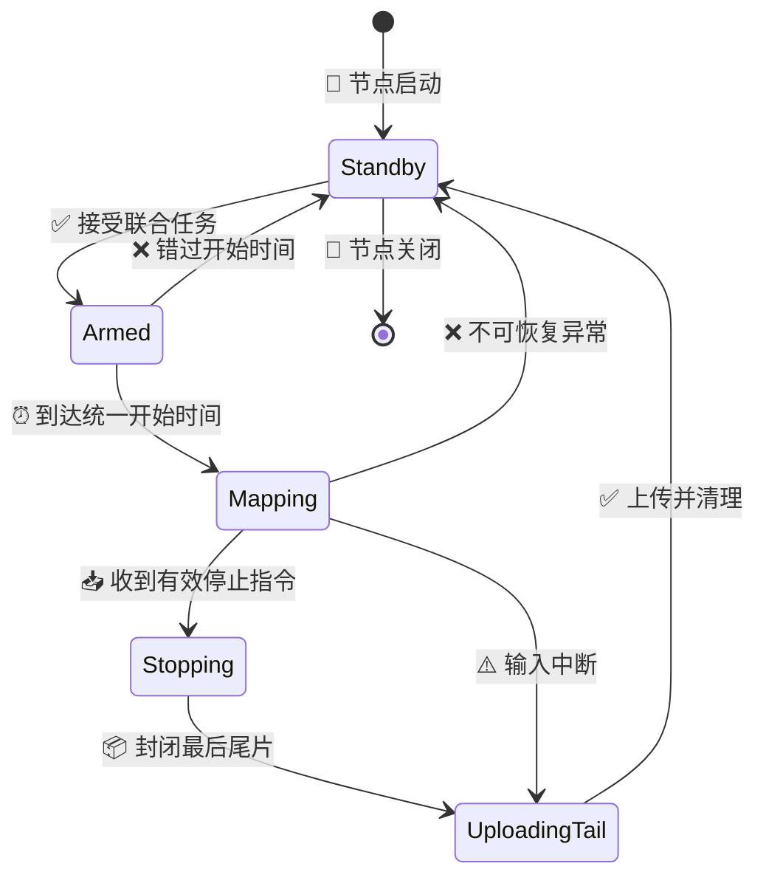

# EPGeneral_multi_map 端侧联合建图需求冻结文档

_CCS_dev 端侧联合建图采集与上传功能需求基线，冻结日期：2026-08-17_

---

## 📋 文档状态

| 项目 | 结论 |
| --- | --- |
| **需求状态** | 已冻结 |
| **目标代码基线** | `CCS_dev_0817` |
| **文档存放位置** | `CCS_dev_0817` 根目录 |
| **目标提交参考** | `main@f2f5c519428673e36de29222af001b7372265567` |
| **新增目录** | `edge_side_pkg/EPGeneral_multi_map` |
| **ROS package 名** | `epgeneral_multi_map` |
| **运行位置** | 机器人端 |
| **实际地图融合位置** | 指控平台 |
| **地面站代码修改** | 本次不修改 |
| **文档性质** | 需求基线，不是正式开发路线 |

本需求遵循 [CCS_dev 增量功能开发标准作业流程（SOP）](../CCS_dev%20增量功能开发标准作业流程（SOP）.md)。[多地图离线联合建图技术方案](../CCS_dev_test/multi-mapping/多地图离线联合建图技术方案.md)仅作为坐标、时间、质量与数据组织的技术参考，不把其中的地面站离线融合范围自动纳入本次实现。

包名中的 `multi` 是项目负责人指定的正式拼写，目录名和 ROS package 名均不得再使用其他拼写。

## 🎯 功能目标与职责边界

新增独立 ROS1 端侧包 `EPGeneral_multi_map`。每台参与机器人运行一个实例，接收指控平台下发的联合建图指令，订阅本机点云与位姿话题，对数据进行严格时间配准，按跨机器人一致的绝对时间窗口切片，并通过既有建图 UDP 通道上传。

端侧只负责以下能力：

- 接收、校验并幂等处理联合建图开始与停止指令
- 按 YAML 配置订阅点云与通用位姿话题
- 为每帧点云匹配或插值对应位姿
- 按统一绝对时间边界生成完整切片和停止尾片
- 上传逐帧点云、对应位姿、切片元数据与状态统计
- 在停止、异常或重启后清理资源并回到待接收指令状态

实际的跨机器人点云配准、位姿图优化、质量评估、地图融合和最终地图发布均由指控平台负责。

## 📦 部署与运行约束

| 内容 | 冻结要求 |
| --- | --- |
| **操作系统** | Ubuntu 20.04 |
| **ROS** | ROS1 Noetic |
| **正式部署 Python** | 系统 Python 3.8 |
| **纯 Python 核心** | 兼容 Python 3.8 及以上 |
| **构建方式** | catkin |
| **实例数量** | 每台机器人一个活动实例 |
| **参与设备数量** | 至少两台物理机器人 |
| **旧包共存** | 不得与 `EPGeneral_map_stream` 同机同时运行 |

新包为独立、自包含、易发现的功能边界。现有 `EPGeneral_map_stream` 保持不变，继续承担原有单机器人实时建图。新包未来可以评估合并为旧包的兼容扩展，但本次不得提前修改旧包。

首版不引入 Open3D、PCL Python 绑定、GPU 或 ROS2 依赖。

## 🌐 输入与通信契约

### ROS 输入

- 点云消息固定为 `sensor_msgs/PointCloud2`
- 点云话题通过新包 YAML 配置
- 位姿话题、`package/Message` 类型、`position_path` 和 `orientation_path` 通过 YAML 配置
- 位姿消息必须具有可用的 ROS 时间戳，并能通过字段路径提取位置和四元数
- 首版不增加纯 TF 查询模式
- frame 名称、静态 `body_from_sensor` 外参及同步容差通过 YAML 配置

现场位姿消息类型可以在部署时确定。只要消息满足上述字段契约，就只需修改 YAML，不应修改切片、同步或协议核心。

### 网络与既有协议

新包复用以下既有接口：

- 协议 ID：`ccs-map-stream-v1`
- schema：`schema_version=1`
- 控制端口：UDP 14561
- 上传端口：UDP 14562
- 信封格式：MessagePack
- 点云压缩：zlib
- 点云格式：`xyz_f32_le`
- 完整性检查：分片数量、分片序号和 `frame_crc32`

不得为本功能新增网络端口或替换既有信封结构。

### 联合任务开始指令

新包只接受具备完整联合任务语义的开始指令。除既有字段外，指令至少必须表达：

- 所有机器人共享的 `collaboration_id`
- 至少两个且不重复的 `participant_device_ids`
- 当前机器人必须属于参与设备列表
- 所有机器人共享的 `map_id`
- 当前机器人的独立 `session_id`
- 所有机器人共享的 `start_at_ns`
- 切片时长；允许指令在端侧安全范围内覆盖 YAML 默认值

缺少联合任务扩展字段的旧开始指令必须被新包拒绝，并使用既有 `command_ack` 结构返回明确原因。新包不得降级执行单机器人即时建图。

### 停止指令

停止指令应表达当前 `collaboration_id`、本机 `session_id` 和统一 `stop_at_ns`。新包按统一停止时间封闭尾片，而不是按各机器人收到 UDP 数据报的本地时刻独立停止。

## ⏰ 时间配准与切片规则

### 统一时间基准

- `start_at_ns`、`stop_at_ns`、切片窗口和 ROS 消息 `header.stamp` 必须处于同一时钟域
- 实机使用 NTP/PTP 同步后的 Unix/ROS wall time
- 生产模式不得混用 `/use_sim_time` 与真实 UTC 时间
- 时间戳为零、明显回退或与当前时钟偏差超过配置阈值时，必须拒绝或丢弃并上报
- 测试可以注入模拟时钟，但不得改变生产语义

指控平台应提前下发未来的统一 `start_at_ns`。机器人先完成输入检查、订阅和缓存准备，到预约时刻开始切片。指令到达时若已经超过允许迟到阈值，机器人必须拒绝该 session，不能自行顺延开始时间。

### 切片边界

- YAML 默认切片时长为 5 秒
- 开始指令可以在配置允许的最小值和最大值之间覆盖切片时长
- 同一 `collaboration_id` 的全部机器人必须使用相同切片时长
- 全部机器人使用相同绝对时间边界，例如 `[10:00:00, 10:00:05)`
- 停止时立即封闭并上传最后一个 `partial=true` 的不完整尾片

### 点云与位姿对应关系

- 每帧点云只关联一个匹配或插值得到的位姿，不增加逐点位姿
- 优先使用点云时间戳前后的位姿进行插值
- 最大允许时间差通过 YAML 配置
- 超过容差的点云帧单独丢弃并累计统计
- 没有任何有效同步帧的窗口不上传空点云，只上报切片错误状态
- 每帧上传数据保留点云时间戳、位姿依据、frame、外参和时间误差统计

首版网络输出仍只包含 XYZ。原始 `PointCloud2` 在当前切片内存周期中保留，以便未来的切片级端侧处理器访问强度、ring 或逐点时间等原始字段；切片发送完成后释放原始消息，不落盘。

## 🔄 生命周期与状态恢复

内部状态可以比协议状态更细，但对外继续使用既有 `starting`、`mapping`、`stopping`、`stopped` 和 `error` 状态语义。

会话规则如下：

- 每台机器人同时只允许一个活动 session
- 重复收到相同请求时幂等返回已有处理结果，不重复订阅或创建 session
- 存在活动 session 时，不同 session 的开始请求返回 `busy`
- 重复停止请求返回已停止状态
- 不属于当前 session 的停止请求必须拒绝
- 正常停止、异常结束和节点重启后都必须释放订阅、缓冲区和会话状态，并回到 `standby`

## ⚠️ 异常、资源与传输策略

| 场景 | 冻结行为 |
| --- | --- |
| **输入话题缺失或类型不符** | 开始前拒绝任务 |
| **运行中点云或位姿超时** | 上传已有有效错误尾片，上报 `error`，清理并复位 |
| **单帧格式错误或非有限坐标** | 丢弃单帧并累计统计 |
| **单帧无法匹配位姿** | 丢弃单帧并记录时间误差 |
| **单个切片资源超限** | 停止接收该窗口新帧，标记 `truncated=true`，后续窗口继续 |
| **开始时间严重错过** | 拒绝 session 并上报 `start_time_missed` 语义 |
| **停止指令迟到** | 按 `stop_at_ns` 截取数据并上报 `stop_time_missed` 语义 |
| **节点重启或致命异常** | 丢弃内存数据，回到 `standby` |
| **UDP 分片丢失** | 由 CRC/分片计数检测；首版不重传 |

每个切片必须具有可配置的最大帧数、最大点数和最大内存字节数。达到限制后只截断当前切片，不因单个超限窗口终止整个联合任务。

首版只使用有界内存，不在机器人端保存 PCD、切片文件或恢复检查点。已成功接收的数据由指控平台负责持久化。

UDP 继续采用可检测错误的尽力传输。端侧发送完成后释放切片，不等待地面站确认；切片 ACK、缺片请求和选择性重传属于未来地面站兼容扩展范围。

## ⚙️ 实现边界

### 预处理边界

- 不新增滤波、去动态目标、运动补偿或其他预处理算法
- 沿用现有距离过滤、体素降采样和发送频率限制的行为语义
- 新增清晰的切片级处理接口
- 当前切片处理器只进行透传
- 完整切片和停止尾片经过同一处理接口

未来增加端侧预处理时，只允许扩展切片处理器，不应改变 ROS 输入契约、session 状态机或既有 UDP 信封。

### 明确不做的内容

- 不修改本次地面站代码或 UI
- 不在机器人端执行跨机器人点云配准或地图融合
- 不在机器人端生成或发布最终 PCD 地图
- 不修改现有 `EPGeneral_map_stream`
- 不执行旧指令的单机器人降级模式
- 不新增纯 TF 位姿查询
- 不新增预处理或滤波算法
- 不实现 UDP ACK、缺片重传或可靠传输
- 不实现端侧切片落盘和重启恢复
- 不支持同机多实例模拟真实联合建图
- 不新增网络端口、协议 ID 或 schema 版本

## ✅ 交付物与验收条件

### 交付物

- 独立 ROS 包 `edge_side_pkg/EPGeneral_multi_map`
- ROS package `epgeneral_multi_map` 的源码、YAML、launch、`package.xml` 和 `CMakeLists.txt`
- 包内 README、CHANGELOG 和版本一致性检查
- 配置、协议、时间窗口、同步、状态机和资源限制测试
- localhost UDP 集成测试
- `docs/地面站兼容扩展说明.md`

### 可验证验收条件

1. 输入合法联合任务指令后，节点在 `start_at_ns` 前不产生建图切片，并在统一时刻进入采集状态
2. 至少两个不重复设备 ID 且包含本机 ID 时接受任务；单设备、重复设备或缺少本机 ID 时拒绝
3. 相同时间边界和切片时长产生确定性的 `slice_id` 与窗口起止时间
4. 每个已上传点云帧具有有效点云时间戳和容差内的对应位姿
5. 无法时间配准的帧被丢弃并准确计数，不导致其他有效帧丢失
6. 收到统一停止指令后，只保留 `stop_at_ns` 之前的数据并上传 `partial=true` 尾片
7. 尾片完成后停止上传、释放 ROS 订阅和缓存，并回到 `standby`
8. 点云或位姿输入中断时，上传已有有效错误尾片、上报错误并复位
9. 切片达到资源上限时只截断当前窗口，后续窗口继续工作
10. 重复开始和停止请求保持幂等，不创建重复 session
11. 缺少联合任务扩展字段的旧指令被明确拒绝
12. 现有 `EPGeneral_map_stream` 文件内容和行为不因本次开发改变
13. 纯 Python 测试在 Python 3.8+ 通过，ROS 构建与集成验收在 Ubuntu 20.04、ROS Noetic、系统 Python 3.8 执行
14. 文档完整列出未来地面站必须实现的协议、切片汇总和可靠传输扩展

## 🔗 后续流程

本文件完成后，开发流程进入 SOP Step 2“现有系统基线审计”。审计、影响范围确认、开源方案检索和正式开发路线审批完成前，不得开始编码。

正式开发路线必须引用本冻结文档，并保持上述目标、边界和验收条件；若后续需要改变冻结内容，应先回到需求讨论，由项目负责人明确批准变更。

---

_冻结确认：项目负责人已于 2026-08-17 在对话中明确回复“需求冻结”。_

## 2026-08-18 工作区环境映射补充

项目负责人将实施基线切换为 `C:\Users\BM\Desktop\重点研发\CCS_dev-main`。该快照的地面站版本为 0.13.1，已经具备多设备 `_ActiveJob`、每设备独立 session、ACK barrier、融合算法和地图保存能力。

本补充不改变冻结的端侧目标和禁止修改项，只消除新环境中的重复概念：冻结需求里的联合任务/`collaboration_id` 语义直接映射到地面站已经存在的共享 `job_id`，不再新增第二个同义标识。现有 `role`、`primary_device_id` 和每设备 `session_id` 原样复用；未来地面站兼容扩展仅需补充 `participant_device_ids`、`start_at_ns`、`slice_duration_ns`、`stop_at_ns` 和切片汇总，不重复实现已有多 session、UI、融合或持久化。
